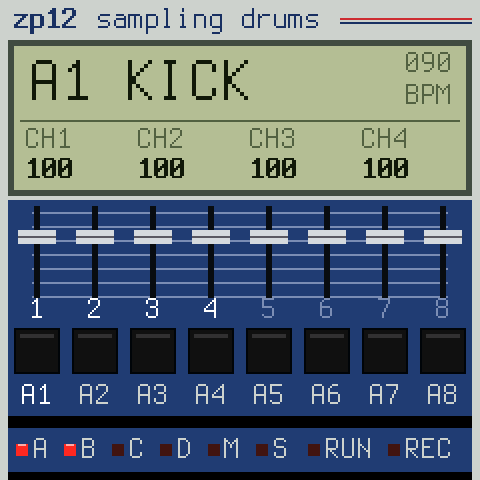
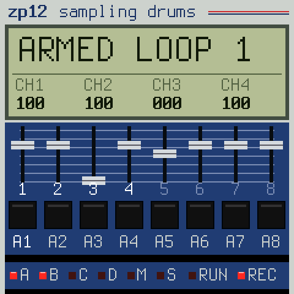
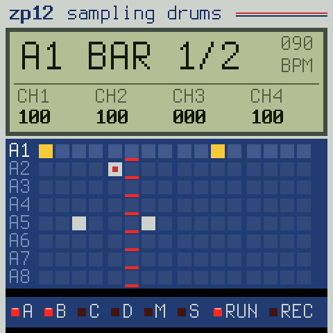
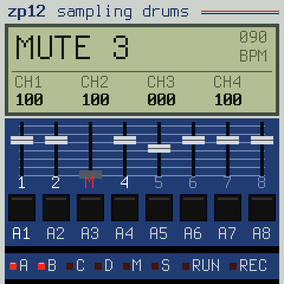
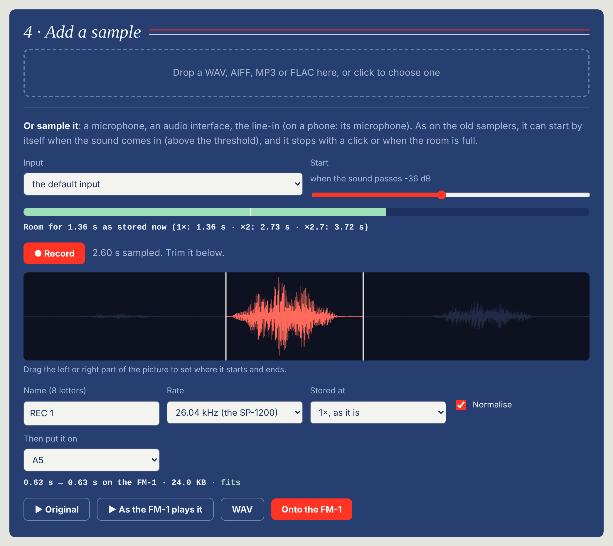

  
  
  
  

  <b><a href="https://zp12.designburgapps.com/">Website</a></b> ·
  <b><a href="https://zp12.designburgapps.com/install/">Install 2.0</a></b> ·
  <a href="https://zp12.designburgapps.com/editor/">Sample editor (sample + drop)</a> ·
  <a href="https://zp12.designburgapps.com/backup/">Backup</a> ·
  <a href="https://zp12.designburgapps.com/#cheatsheet">Cheat sheet</a> (<a href="https://zp12.designburgapps.com/zp12-cheat-sheet.pdf">PDF</a>) ·
  <a href="https://zp12.designburgapps.com/#video">Video</a>

  
  
  
  

 
New in 2.0: sample from a microphone, an interface or the line-in in the <a href="https://zp12.designburgapps.com/editor/">editor</a>, trim it, onto a pad.

# zp12

A 12-bit sampling drum machine for the **M-VAVE FM-1**: 32 sounds at 26.04 kHz (or 27.5 kHz), pitched
without interpolation, eight output channels with their filters, a panel-style screen. Inspired by the
12-bit samplers of the 80s; their names are trademarks of their owners, no affiliation.

> **Status: 2.0** (2026-10-08). Install: **https://zp12.designburgapps.com/install/** · Sample editor (now with
> sampling in the browser): **https://zp12.designburgapps.com/editor/** · Backup: **https://zp12.designburgapps.com/backup/** ·
> Cheat sheet: **https://zp12.designburgapps.com/#cheatsheet** ([PDF](https://zp12.designburgapps.com/zp12-cheat-sheet.pdf)).
>
> The factory kit on the keys (bank C6–C8: a grand piano, Cm9 and F13 stabs and a note, VCSL CC0; bank D: E-piano chords, horns, vibes, bass,
> scratches), eleven loops on the black keys, the sequencer (loops of 1–32 bars or AUTO, song, real-time recording with count-in and AUTO CORRECT, step editing, swing, erase, tap tempo), sloopDX's
> chorus, delay and reverb, saved in flash (0xC4000.., a room sloopDX leaves free), own samples from the web editor.
> Plan: [CONCEPT.md](CONCEPT.md), open work: [TODO.md](TODO.md).

## New in 2.0

- **Sampling in the browser**: the editor records from a microphone, an audio interface or the line-in (on a phone:
  its microphone), with a level meter, a threshold start as on the old samplers, and a stop by click or when the
  FM-1's free room is full (shown in seconds before you record). Then as before: trim, 26 / 27.5 kHz, 45→33, ×2,
  hear it as the FM-1 plays it, onto a pad. No firmware needed for this part.
- **Count-in that does what you expect**: GLO → CLICK → COUNT (OFF, 1 or 2 bars); DUB: an overdub while playing
  starts at once or from the next bar's 1 (COUNT in the LCD). ARMED and COUNT 4 3 2 1 big in the LCD. A REC press
  shorter than 2 s is always a tap; held 2 s it clears the loop.
- **Mute / solo**: GLO held + white keys 1–8 mute channels 1–8, 9–16 solo them (in ~3 ms, no click, the pattern
  plays on); M / S under the faders, the keys show the state while GLO is held.
- **Filters made clear**: EDIT → OUT shows CUT / RESO as `--` on pads 3–8 (only 1–2 have the dynamic filter);
  turning them says FILTER: PADS 1-2.

Install from Chrome or Edge: https://zp12.designburgapps.com/install/ (also https://dx7.designburgapps.com/zp12/).
Back to sloopDX or SLOOP any time with their installers; if the FM-1 does not answer, hold OCT− while
switching it on (USB rescue).

## Playing (0.4)

| | |
| --- | --- |
| White keys 1–8 · 9–16 | bank A · B pads (OCT+: C · D, OCT−: back) |
| Black keys | loops 1–11 (segments): stopped at once, playing from the end of the loop |
| KNOB 1–4 | the faders of channels 1–4 (SEL: 5–8, lit, until pressed again; from a page it goes to the faders); a page takes them (the header says which, its tabs show the others), untouched 12 s (GLO → SETUP → BACK: 6 s … OFF) or HOME gives them back |
| EDIT | WAVE (the pad's sample · COPY> · COPY the sound to a pad), SOUND (TUNE · FINE · DECAY · LEVEL), TRUNC (START · END · DIR · SPEED 45/33), OUT (CHAN: the pad's position · PAN · CUT · RESO; `--` on pads 3–8, which have no dynamic filter), SENDS (DRIVE · CHO · DLY · REV) of the last pad |
| FX | FILTER (a DJ filter on the mix: LP · OFF · HP, RESO), CHORUS (RATE · DEPTH · MIX), DELAY (TIME · FDBK · COLOR · MIX), REVERB (SIZE · DAMP · PRE) |
| SEQ tapped | LOOP (LOOP · BARS 1–32 / AUTO · QUANT · SWING), LOOP TOOLS (CLEAR · COPY> · COPY, turn twice), SONG (STEP · LOOP · REPEAT, 0 ends · SONG OFF / 1–4: four songs of the loops) |
| SEQ held | the last pad's 16 steps of a bar on the white keys (lit = a hit); OCT− / OCT+: the bars |
| PLAY · REC | run / stop · record (stopped: ARMED, PLAY counts in: GLO → CLICK → COUNT off / 1 / 2 bars; playing: overdub on / off, at once or from the next 1: DUB); a press under 2 s is always a tap, REC held 2 s: clear the loop |
| GLO held + white keys | 1–8 mute channels 1–8, 9–16 solo them (M / S under the faders) |
| Recording + TUNE / FINE / DECAY / CUT turned | the pad's hits keep the values turned (a lock per hit, a red dot in the step grid) |
| EDIT + OCT− | undo the last clear / erase / copy (again: redo) |
| LFO held + pad | erase that pad's hits as the playhead passes (stopped: at once) |
| ENV · GLO · SAVE | tap tempo · SETUP (TEMPO, BACK: pages back after 6–60 s or never, RESET: turn twice, the factory state), CLICK (CLICK · COUNT · DUB), OUTPUT (SMOOTH) · save now (it saves by itself when stopped and quiet); SAVE held + a black key: the loop into that loop |
| ARP | MULTI PITCH: the last sound over all 27 keys (F4 as tuned) |
| SELECT · ALGORITHM · PRESETS | tempo · the sound to edit · the sample of the last pad (one sample on many pads, each tuned its own way) |
| USB MIDI | notes 36–67 play pads A1–D8 |
| Own samples | https://zp12.designburgapps.com/editor/: sample (mic, interface, line-in, threshold start) or drop a WAV, trim, 26 / 27.5 kHz, 45→33, hear it as the FM-1 plays it, onto a pad (2.5 s free, 6.3 s with sloopDX's bank room; 1.4+) |
| Backup | https://zp12.designburgapps.com/backup/: loops, sounds, songs, samples and sloopDX's DX7 banks in one file, and back (Chrome / Edge, 1.3+) |

## Sound

- 12-bit linear samples, packed, at 26.04 / 27.5 kHz; pitch by the playback rate with a zero-order hold
  (no interpolation): the aliasing is the sound. 45→33: stored fast, played slow.
- Channels 1–2: a 4-pole resonant low-pass (SSM2044-style), open as CUT at the hit and closing two octaves
  as the sound decays (the original's dynamic filters); 3–6: a fixed low-pass; 7–8: none. The order is the
  hardware's: sample, VCA (decay), DRIVE, filter, then the channel's fader. One sound per channel at a time. A pad's channel
  is its position, 1–8 in every bank (2.1, as on the SP-1200): fader, mute, solo, the filter and the choke follow the pad.
- Stored fast, played slow (the old trick): 45→33 per sound, and own samples at ×2 (an octave down on the
  pad, TUNE −12 set for you) or ×2.7: more time in the same memory, half the bandwidth, the grit.
- The master: −6 dB and a soft knee above 3/4, so a pile of hits rounds off instead of clipping hard.
- The start (a key skips it) plays its ba-dum-tss on the pads A8, A7, A1 + B1: put your own sounds there for your own.
- SMOOTH (GLO → OUTPUT, on by default): where a sound is cut mid-wave (a new hit on its channel, its end, a TRUNC
  start) the jump is bridged in ~1 ms, so it does not click; a sample from its own beginning keeps its attack.
- Faders and LEVEL in an audio taper, as the original's sliders: 100 as set, 50 −12 dB, 25 −24 dB, 127 +4 dB.
- `firmware/src/sp_core.c`; host test `tests/sp_core_test.c` renders a demo WAV.

## Build

`sh build.sh [--release X.Y]` (JieLi toolchain and AC79 SDK as for SLOOP: `tools/get_toolchain.sh`).
Host: `cc -O2 -o build/host/sp_core_test tests/sp_core_test.c -lm`, `tests/zp12_ui_test.c` (screens as PPM).

## Credits and licence

GPL-3.0. Built on **SLOOP** by isod89 (github.com/isod89/sloop-fm1) and **Felucca** by Leo Kuroshita
(Hügelton Instruments), with the FM-1 platform as **sloopDX** carries it; SLOOP's README is kept as
`SLOOP-README.md`. Factory sounds: CC0 (VSCO-2 CE, VCSL, Sonic Pi; `assets/samples-cc0`); bank D from SLOOP's hip-hop pack, the
E-piano by Greg Sullivan (CC BY 3.0, `assets/samples-cc0/HIPHOP/CREDITS.txt`). Not affiliated
with M-VAVE.
